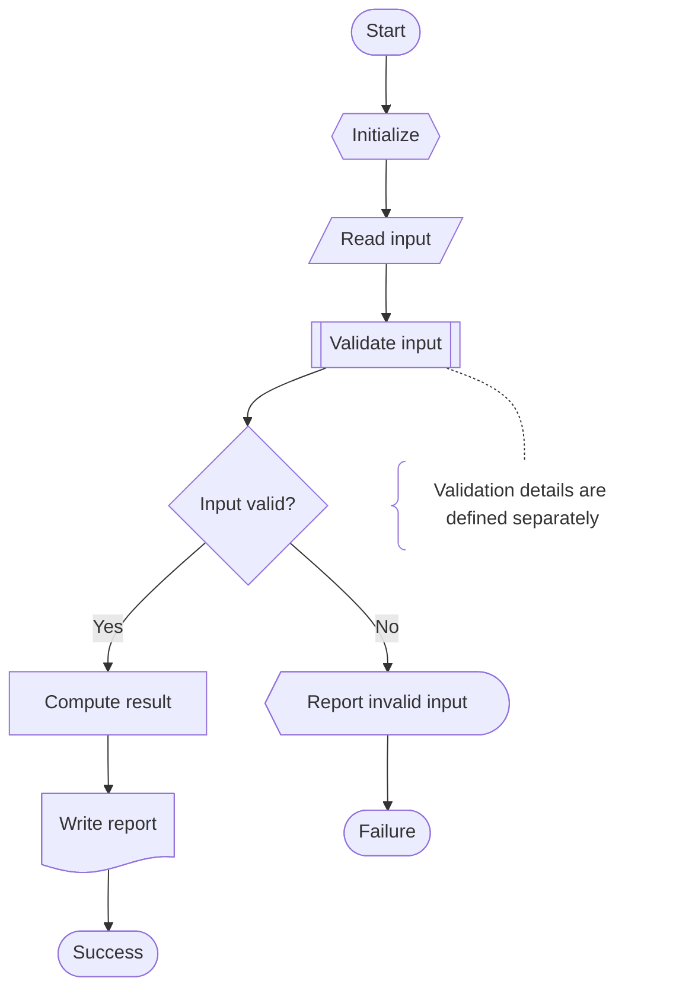
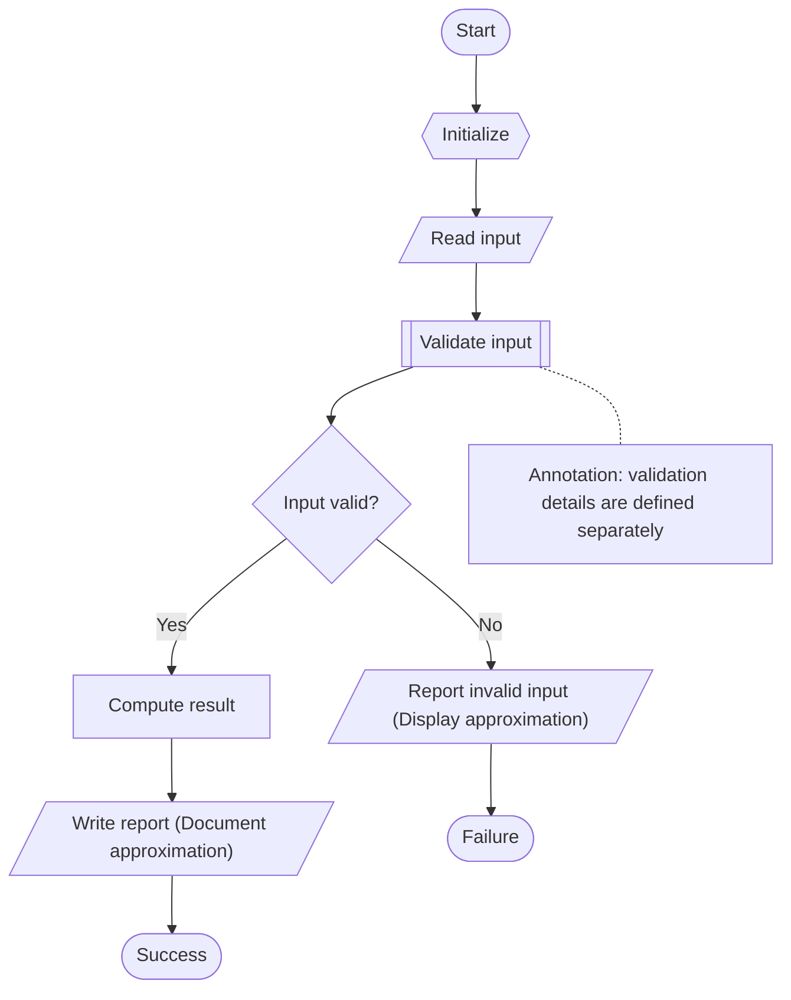
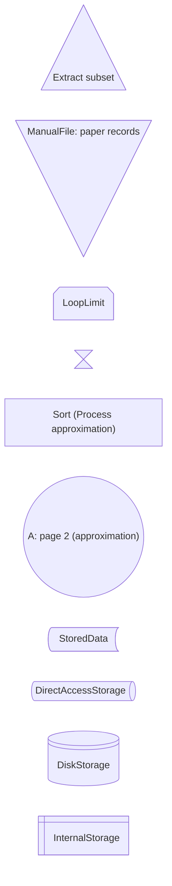
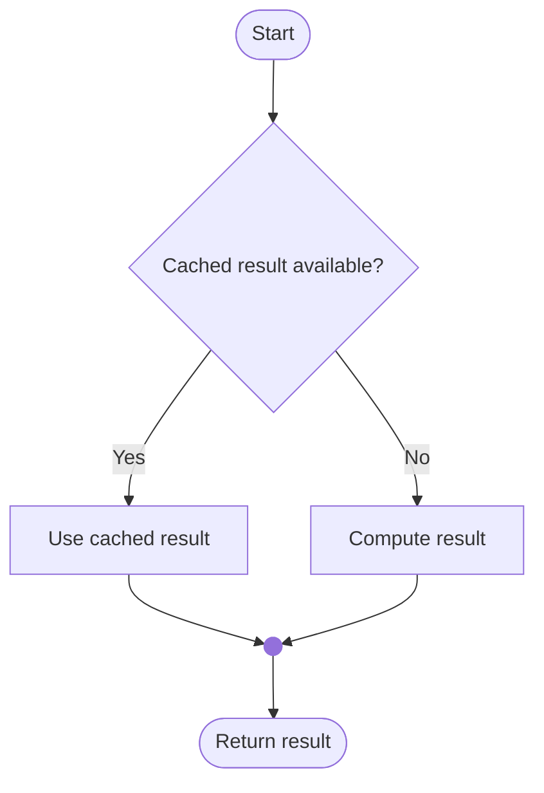
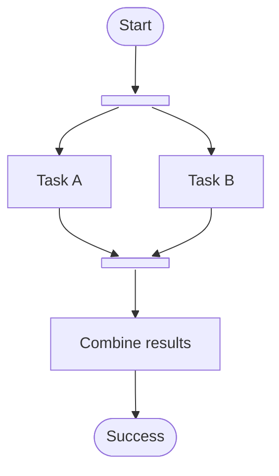

# Mermaid Flowchart Examples

Companion to the [terminology and symbol reference](../references/flowchart.md). These synthetic examples illustrate notation, not repository execution or scientific results. Expanded shapes require Mermaid v11.3.0+ in the actual renderer; older renderers should use the classic-syntax example below with explicitly labeled approximations.

## 1. Node Syntax and Selection

| Form | Syntax Example | Use |
|:-----|:---------------|:----|
| Expanded | `step@{ shape: rect, label: "Process" }` | Supported named shapes in Mermaid v11.3.0+ |
| Classic Process | `step["Process"]` | Ordinary operation |
| Classic Terminal | `entry(["Start"])` | Entry or termination |
| Classic Decision | `gate{"Valid?"}` | Conditional branch |
| Classic InputOutput | `data[/"Read input"/]` | Generic I/O |
| Classic PredefinedProcess | `call[["Validate"]]` | Named routine |
| Classic Preparation | `setup{{"Initialize"}}` | Setup |
| Classic Database | `store[("Database")]` | Database convention |
| Classic Connector | `next(("A"))` | Labeled continuation |

Selection guide:

- Use classic syntax for supported basic shapes when brevity or older-renderer compatibility matters.
- Use expanded syntax for specialized shapes only when the renderer supports it.
- If no documented equivalent exists, use a labeled basic shape and disclose the approximation.
- A shape does not implement branching, waiting, storage, or exception handling; edges and labels must describe those semantics.
- Quote labels and avoid the reserved lowercase node ID `end`; use `finish` instead.

## 2. Flow Line Syntax

| Connection Type | Syntax | Example |
|:----------------|:-------|:--------|
| Solid arrow | `-->` | `A --> B` |
| Labeled arrow | `-->|text|` | `A -->|Yes| B` |
| Thick arrow | `==>` | `A ==> B` |
| Dotted arrow | `-.->` | `A -.-> B` |
| Labeled dotted arrow | `-. text .->` | `A -. maybe .-> B` |
| Undirected link | `---` | `A --- B` |
| Dotted undirected link | `-.-` | `A -.- note` |

Solid arrows denote control flow in the program examples. Dotted undirected links attach annotations, not execution steps. Thick/dotted styles have no universal priority, probability, or concurrency meaning; declare any special convention.

## 3. Program Flow with Distinct Failure Exit

Existing-code maps should replace synthetic labels with verified `L<number>` references and add repository-relative `click` destinations when supported. Click behavior depends on the host's security settings; retain prose evidence links regardless.

## 4. Classic-Syntax Compatibility

This uses the same control paths as section 3. Report and display shapes are approximated by labeled InputOutput nodes; the annotation is a labeled Process outline attached by a non-control link.

## 5. Corrected Symbol Gallery

This is a gallery, not an execution sequence. Extract uses an upward triangle; ManualFile uses a downward triangle. LoopLimit is not an off-page connector, and Collate is not Sort. A Connector with a destination label approximates off-page continuation.

## 6. Alternative Merge versus Concurrent Join

### Alternative Branches

Only one branch executes per decision. The filled-circle Junction rejoins alternatives; it does not wait for both.

### Concurrent Fork and Wait-for-All Join

The two bars are Mermaid's fork/join convention, not an exact ISO ParallelMode symbol mapping. Both branches start; the join waits for both completions. This bounded example assumes both tasks complete normally; a real-code map must show verified failure, cancellation, and timeout behavior.

