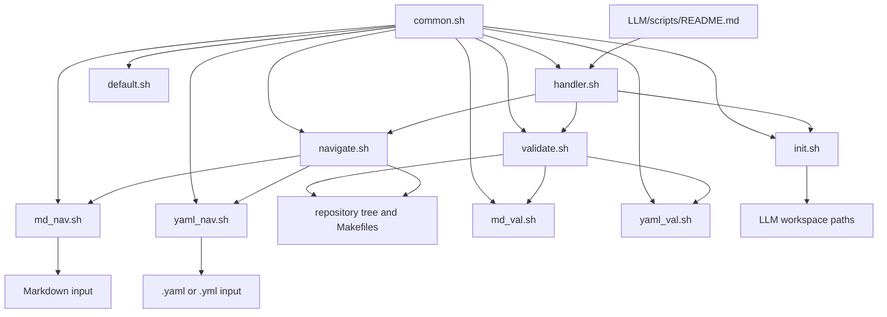
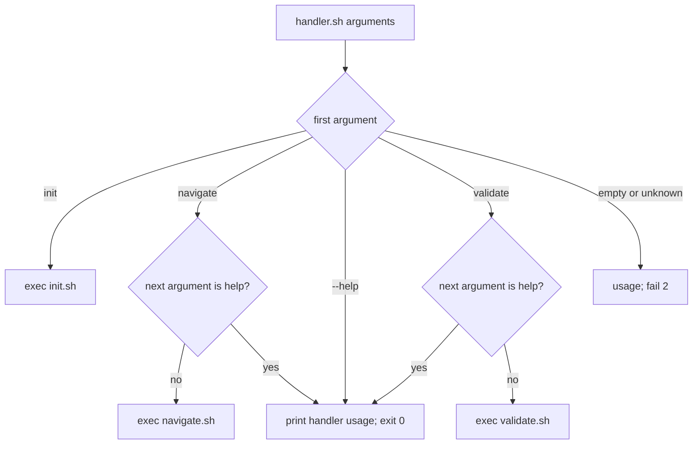
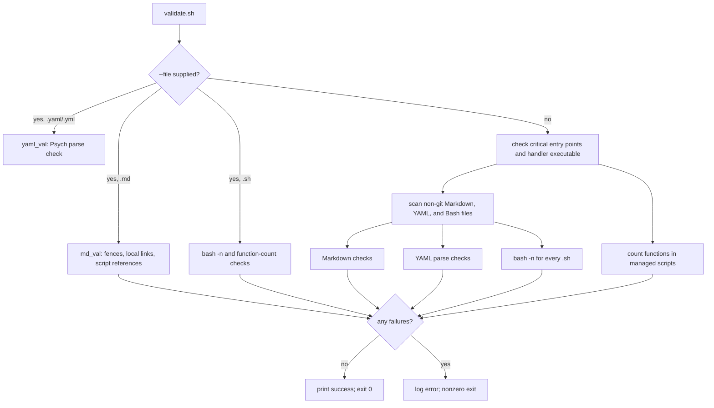

# LLM Script Suite

This directory contains small Bash helpers for the `LLM/` knowledge and review workspace. They initialize its documentation scaffold, emit repository navigation manifests, validate Markdown and Bash structure, and provide read-only Markdown and YAML navigation. The project-wide rules in [`../../AGENTS.md`](../../AGENTS.md) and the workspace boundary in [`../README.md`](../README.md) apply to every command here.

This document describes the behavior implemented by the current scripts. It does not establish scientific results, operate the OGS seismicity pipeline, or authorize access to data or external services.

## Purpose And Safety

Each directly executable script uses `set -euo pipefail` and `umask 077`. They derive their own script directory from `BASH_SOURCE[0]`, so their internal `source` and delegated-script paths do not depend on the caller's current directory.
[`common.sh`](common.sh) is source-only and inherits the options of its calling script.
[`handler.sh`](handler.sh) is the public command dispatcher for workspace lifecycle tasks.
[`init.sh`](init.sh) is the only suite command that creates files or directories. It preserves existing paths and supports a no-mutation `--dry-run` mode.
[`navigate.sh`](navigate.sh), [`validate.sh`](validate.sh), [`md_nav.sh`](md_nav.sh), [`yaml_nav.sh`](yaml_nav.sh), [`md_val.sh`](md_val.sh), and [`yaml_val.sh`](yaml_val.sh) read files only; their generated content goes to standard output and their diagnostics go to standard error through shared helpers.
[`default.sh`](default.sh) is a commented starting template, not an operational workflow.

No script in this directory contains code to download data, install packages,
call an LLM provider, run inference, or submit a job. This is an observation
of these script sources, not a claim about commands invoked elsewhere in the
repository.

## Files And Relationships

| File | Role | Direct invocation |
|---|---|---|
| [`common.sh`](common.sh) | Shared logging, failure, executable checks, integer validation, and navigator dispatch. | Source-only; no CLI. |
| [`handler.sh`](handler.sh) | Canonical dispatcher for initialization, manifest generation, and validation. | `bash LLM/scripts/handler.sh COMMAND [OPTIONS]` |
| [`init.sh`](init.sh) | Creates missing `LLM/` directories and three starter README files. | `bash LLM/scripts/init.sh [--dry-run]` |
| [`navigate.sh`](navigate.sh) | Emits Tier 1 or Tier 2 YAML context manifests. | `bash LLM/scripts/navigate.sh [OPTIONS]` |
| [`validate.sh`](validate.sh) | Coordinates Markdown, YAML, and Bash validation. | `bash LLM/scripts/validate.sh [--root DIR\|--file FILE]` |
| [`md_nav.sh`](md_nav.sh) | Lists or extracts Markdown headings, sections, and line slices. | `bash LLM/scripts/md_nav.sh COMMAND ...` |
| [`yaml_nav.sh`](yaml_nav.sh) | Lists or extracts conservative YAML block-mapping structures and line slices. | `bash LLM/scripts/yaml_nav.sh COMMAND ...` |
| [`md_val.sh`](md_val.sh) | Validates Markdown fences, local links, and project script references. | `bash LLM/scripts/md_val.sh [--root DIR\|--file FILE]` |
| [`yaml_val.sh`](yaml_val.sh) | Parses YAML inputs with Ruby's standard Psych parser. | `bash LLM/scripts/yaml_val.sh [--root DIR\|--file FILE]` |
| [`default.sh`](default.sh) | Copyable script template demonstrating the local Bash conventions. | `bash LLM/scripts/default.sh [OPTIONS] [ARGUMENTS]` |
| [`README.md`](README.md) | This source-bounded developer reference. | Not executable. |



`handler.sh` sets `LLM_HANDLER_SCRIPT_NAME` while it `exec`s a delegated command.
`init.sh`, `navigate.sh`, and `validate.sh` use that value as their reported script name when present; direct invocation uses their own basename.
The two navigator scripts (`md_nav.sh` and `yaml_nav.sh`) are separate public, direct-only utilities and are not subcommands of `handler.sh`.
The two validator scripts (`md_val.sh` and `yaml_val.sh`) are called by `validate.sh`; they also support the same `--root` and `--file` forms for focused direct validation.

## Public Entry Points

Run these commands from the repository root so the documented relative paths name the intended inputs. Each command below is implemented by the current source; error messages and timestamps are not stable API fields.

### Handler

```text
bash LLM/scripts/handler.sh init [--dry-run]
bash LLM/scripts/handler.sh navigate [--root DIR] [--module PATH] [--include-assets] [--scripts]
bash LLM/scripts/handler.sh validate [--root DIR|--file FILE]
bash LLM/scripts/handler.sh --help
```

The handler accepts exactly `init`, `navigate`, or `validate` as its first argument, then replaces itself with the corresponding script using `exec`.
It requires `date` and `printf` before dispatch.
`--help` exits successfully after printing handler usage.
A missing or unknown command prints usage and fails with status 2.
With `navigate --help` or `validate --help`, the handler prints its own usage and exits successfully rather than delegating.
`init --help` is delegated and is rejected by `init.sh` as an unknown option.



### Initializer

`init.sh` accepts no positional arguments. Its only accepted option is a single leading `--dry-run`; any remaining argument fails with status 2. It requires `date`, `printf`, and `mkdir`.

Without `--dry-run`, it runs `mkdir -p` for these paths relative to `LLM/`:

```text
00_governance  01_context  02_prompts  03_workflows  04_experiments 05_evaluations  06_outputs  07_archive  config  scripts  templates
```

It creates these files only when the path does not already exist:

```text
04_experiments/README.md
06_outputs/README.md
07_archive/README.md
```

Existing paths are preserved. With `--dry-run`, it reports missing directories and absent starter files it would create, identifies existing paths as preserved, and does not call `mkdir` or write the starter files. It still writes its completion message to standard output.

### Context Manifest Navigator

```text
bash LLM/scripts/navigate.sh [--root DIR] [--module PATH] [--include-assets] [--scripts]
```

`navigate.sh` accepts only the options above and no positional arguments. It requires `date` and `printf`; its scan also uses standard shell utilities such as `find`, `grep`, `cut`, `sort`, and `sed` without preflight checks. `--root` must resolve to an existing directory. If omitted, the scan root is the repository parent of `LLM/`. The script emits YAML to standard output and does not write a manifest file.

Without `--module`, it emits a Tier 1 manifest for the `OGS`, `doc`, and
`LLM` modules. The optional `--include-assets` is accepted in this mode but
does not alter Tier 1 output. `--scripts` is forbidden in Tier 1 and fails
with status 2.

With `--module REL_PATH`, the script emits a Tier 2 manifest. The module must
be relative, exist beneath the resolved root after canonicalization, and may
not escape that root through path traversal or a symlink. Tier 2 inventories
non-hidden text files with extensions `.md`, `.py`, `.sh`, `.tex`, `.bib`,
`.yml`, `.yaml`, or `.json`, plus `Makefile`. `--include-assets` additionally
lists `.png`, `.jpg`, `.jpeg`, `.pdf`, and `.svg` files. `--scripts` appends
Make targets, Bash function declarations, and Python `def` declarations found
under the selected module. Listed paths are stably sorted by the commands in
the implementation.

`--help` passed directly to `navigate.sh` fails with status 2 and directs the
caller to handler help. Use `bash LLM/scripts/handler.sh --help` for usage.

### Workspace Validator

```text
bash LLM/scripts/validate.sh [--root DIR|--file FILE]
```

`validate.sh` accepts `--root DIRECTORY` and `--file FILE`; it has no
positional arguments. When both options are supplied, `--file` takes
precedence. With `--file`, only a regular file ending in `.md` or `.sh` is
supported. Markdown single-file validation checks balanced fenced code blocks,
relative Markdown link targets, and references matching the project script
path patterns. Bash single-file validation runs `bash -n` and checks each
function declaration's documented body count.

Without `--file`, the resolved root defaults to the repository root and the
complete validation runs. It first checks that `AGENTS.md`, `LLM/README.md`,
and `LLM/scripts/handler.sh` are non-empty, and that `handler.sh` is
executable. It then inspects all non-git `*.md` and `*.sh` files below the
root for non-empty content, Markdown fences and local links, script
references, and Bash parse syntax. It additionally checks documented function
body counts for the managed set: `common.sh`, `handler.sh`, `init.sh`,
`navigate.sh`, and `validate.sh`.

The validator reads only; `bash -n` parses but does not execute Bash scripts.
It reports findings to standard error, returns nonzero on detected failures,
and prints a success message only when its selected checks find no failure.
Direct `validate.sh --help` fails with status 2 and directs the caller to
handler help.



### Markdown And YAML Navigators

Both direct navigator scripts accept the following command forms:

```text
bash LLM/scripts/md_nav.sh outline FILE [--depth MAX_DEPTH] [--from START_LINE] [--to END_LINE]
bash LLM/scripts/md_nav.sh get FILE START_LINE
bash LLM/scripts/md_nav.sh slice FILE START_LINE END_LINE

bash LLM/scripts/yaml_nav.sh outline FILE [--depth MAX_DEPTH] [--from START_LINE] [--to END_LINE]
bash LLM/scripts/yaml_nav.sh get FILE START_LINE
bash LLM/scripts/yaml_nav.sh slice FILE START_LINE END_LINE
```

`outline`, `get`, and `slice` are dispatched by `common.sh`. No command prints
usage with no command: missing or unknown commands fail with status 2.
`--help` as the command prints the script's usage and exits successfully.
The shared dispatcher requires `awk` for `outline` and `get`, and `sed` for
`slice`; command-specific input validation happens in the selected function.

`md_nav.sh` accepts a readable regular file with any name. `outline` defaults
to depth 6 and lines 1 through 999999999; it lists ATX headings outside fenced
code blocks as absolute line, depth, and heading text. It accepts positive
integer `--depth`, `--from`, and `--to` values, limits depth to 6, and requires
the start line not exceed the end line. `get` requires a positive heading-line
number and prints from that heading through the next heading of equal or
higher prominence; a line that is not a heading produces no extracted content
without a dedicated error. `slice` requires two positive ordered line numbers
and prints the inclusive range.

`yaml_nav.sh` also requires a readable regular file, but its extension must be
`.yaml` or `.yml`. It is a conservative structural navigator, not a YAML
parser or validator. `outline` defaults to depth 99 and recognizes plain,
block-mapping keys beginning with a letter or underscore, including supported
sequence mapping entries. It skips comments, resets at YAML document markers,
and ignores block-scalar content. `get` prints the recognized entry and its
indented block; a target line that is not a recognized mapping fails with
status 2. Its `slice` behavior matches the Markdown navigator.

### Script Template

`default.sh` is intended to be copied and completed for a new small Bash
workflow. Its current `main` accepts `-h` or `--help`, an optional `--` end of
options marker, and otherwise stops option parsing before calling placeholder
`validate_config` and `run` functions. The template's current operation only
logs start and completion; it performs no workflow-specific action. Replace
the placeholders before treating a copy as an operational command.

## Function Inventory

The declarations below are grouped by owning file. Responsibilities summarize
the implemented body; shared functions are listed only under
[`common.sh`](common.sh).

| File | Functions and responsibility |
|---|---|
| [`common.sh`](common.sh) | `log`: timestamped standard-error diagnostic; `fail`: log and exit a supplied status; `require_command`: require an executable on `PATH`; `validate_positive_integer`: enforce a nonzero decimal integer; `validate_navigation_config`: require the selected navigator dependency; `run_navigation_command`: parse and dispatch `outline`, `get`, or `slice`. |
| [`handler.sh`](handler.sh) | `usage`: print dispatcher usage; `main`: validate the top-level command and `exec` its implementation. |
| [`init.sh`](init.sh) | `initialize`: conditionally create workspace paths and starter records; `main`: parse optional dry-run mode and invoke initialization. |
| [`navigate.sh`](navigate.sh) | `yaml_escape`: encode a YAML scalar when needed; `discover_validate`: statically list validation-like Make targets; `scan_conflicts`: report missing entry points or a missing scoped target; `emit_tier1`: produce global routing YAML; `extract_symbols`: list Make, Bash, and Python declarations; `emit_tier2`: produce scoped inventory YAML; `main`: parse options, contain module paths, and select a tier. |
| [`validate.sh`](validate.sh) | `validate_markdown`: scan Markdown fences and local paths; `validate_scripts`: scan Markdown for stale project script references; `validate_bash`: parse all discovered Bash files; `validate_functions`: compare annotated and counted function bodies; `validate_single`: select the supported one-file checks; `validate_managed_functions`: check the curated managed-script list; `validate`: run full-root checks; `main`: parse options and dispatch. |
| [`md_nav.sh`](md_nav.sh) | `usage`: print command usage; `validate_file`: require a readable regular file; `run_outline`: list headings outside code fences; `run_get`: extract a heading's section; `run_slice`: extract an inclusive line range; `main`: call the shared dispatcher. |
| [`yaml_nav.sh`](yaml_nav.sh) | `usage`: print command usage; `validate_yaml_file`: require a readable YAML-named file; `run_outline`: list recognized mappings outside block scalars; `run_get`: extract a recognized mapping block; `run_slice`: extract an inclusive line range; `main`: call the shared dispatcher. |
| [`default.sh`](default.sh) | `usage`: print template usage; `validate_config`: placeholder prerequisite validation; `run`: placeholder operation; `main`: template option parsing and lifecycle ordering. |

## Shared Helper Contract

Scripts source [`common.sh`](common.sh) after defining `SCRIPT` and
`SCRIPT_DIR`. Therefore `log` identifies messages using the caller-owned
`SCRIPT` value. `fail` terminates the current script process, so it is used for
invalid arguments, unavailable commands, and validation errors rather than as
a return-value helper.

`run_navigation_command` receives function names from each navigator, rather
than knowing Markdown or YAML details. It handles command selection and only
then calls `validate_navigation_config`, allowing `--help` to remain
side-effect free. The content-specific file checks stay in
[`md_nav.sh`](md_nav.sh) and [`yaml_nav.sh`](yaml_nav.sh).

## Validation Design

The validator deliberately uses lightweight structural checks rather than
executing project workflows. Markdown link checking considers links with a
local path component and ignores `http*` and `mailto:` links. The path must
exist relative to the document; fragments do not select or validate a heading.
It also searches Markdown for references in these path families:

```text
LLM/scripts/*.sh
OGS/utils/Leonardo/*.sh
OGS/utils/.local/*.sh
```

For Bash function counts, the validator finds declarations matching the local
`name() {` form, reads the inline `{ # N` count, and counts through the next
line consisting solely of `}`. Use the file-mode check whenever changing a
script with the function-count convention:

```bash
bash LLM/scripts/handler.sh validate --file LLM/scripts/handler.sh
```

This README is a Markdown input to the same validator. Its links are relative
to `LLM/scripts/`, and the Mermaid blocks use balanced triple-backtick fences.

## Extending The Suite

Start from [`default.sh`](default.sh) and retain the script header,
`set -euo pipefail`, `umask 077`, derived `SCRIPT`/`SCRIPT_DIR`, quoted
expansions, and the validate-before-mutate lifecycle. Document every function
immediately before its declaration and maintain the `{ # N` count. Add a
command to [`handler.sh`](handler.sh) only when it belongs in the public
workspace lifecycle; otherwise keep a focused direct script such as the two
navigators.

For a script that mutates files, define its input/output boundary, validate all
arguments before mutation, preserve existing data unless replacement is an
explicit interface, and provide a dry-run mode where practical. A new script
that should receive full-root function-count checks must also be added to the
managed list in [`validate.sh`](validate.sh). Add safe commands and linkable
documentation at the same time; the validator can then detect stale local
script paths.

Do not make the scripts infer scientific conclusions from documents, catalogs,
or model output. Keep operational claims tied to executable behavior and keep
scientific review records under the workflow described by [`../README.md`](../README.md).

## Safe Commands

These commands are read-only except for the explicitly dry-run initializer;
they are suitable for inspecting the current checkout from its root.

```bash
# Display supported public commands.
bash LLM/scripts/handler.sh --help

# Emit the global Tier 1 manifest to standard output.
bash LLM/scripts/handler.sh navigate --root "$PWD"

# Emit a scoped Tier 2 manifest with symbol declarations.
bash LLM/scripts/handler.sh navigate --module LLM/scripts --scripts

# List top-level and second-level headings without changing the source file.
bash LLM/scripts/md_nav.sh outline LLM/README.md --depth 2

# Inspect conservative YAML structure without parsing or rewriting the file.
bash LLM/scripts/yaml_nav.sh outline OGS/config/config.yaml --depth 2

# Report only what workspace initialization would create.
bash LLM/scripts/handler.sh init --dry-run

# Validate this documentation file.
bash LLM/scripts/handler.sh validate --file LLM/scripts/README.md
```

Do not use `init` without `--dry-run` unless creating missing workspace paths
and the three starter files is intended. Full-root validation is also
read-only, but it checks every Markdown and Bash file below the chosen root
and can report unrelated existing findings.
