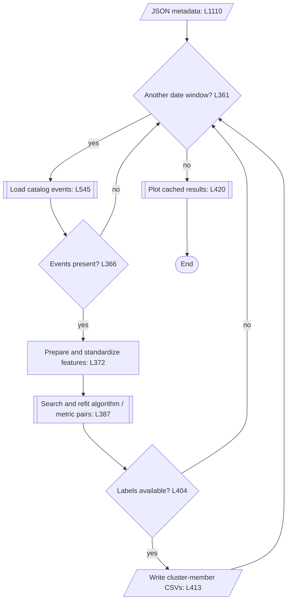

# OGS Seismic Toolkit

The implementation layer for legacy catalog ingestion, waveform acquisition, ML-pipeline integration, catalog comparison, and sequence clustering.
The descriptions below reflect executable source and configuration, not validated scientific results or a guarantee of runtime availability.

## Guide

- [Runtime and entrypoints](#runtime-and-entrypoints)
- [Catalog ingestion and storage](#catalog-ingestion-and-storage)
- [Catalog comparison](#catalog-comparison)
- [Sequence clustering](#sequence-clustering)
- [ML pipeline and execution](#ml-pipeline-and-execution)
- [Verification and provenance](#verification-and-provenance)

| Directory | Reference |
|---|---|
| `src/` | [Module index and lazy public API](src/README.md) |
| `conf/` | [Hydra configuration and stage selection](conf/README.md) |
| `test/` | [Tests, fixtures, and focused commands](test/README.md) |
| `utils/` | [Leonardo and local execution boundaries](utils/README.md) |
| `data/` | Reference catalogs and velocity-model resources; not the runtime waveform archive |

## Runtime and entrypoints

The Leonardo environment is configured as `SBC_3.12` in the [Makefile](utils/Leonardo/Makefile); its environment definition is [LEONARDO.yml](utils/Leonardo/LEONARDO.yml). 

A compatible external `ml_catalog` installation is needed for integration modules. Scientific and optional dependencies are required by the selected workflow, even though the public package imports classes lazily.

For an existing, approved Leonardo environment, set `WORK_PATH` to the workspace configured in the Makefile. Derive the Conda prefix rather than hardcoding an environment path; mirror any Makefile overrides:

```bash
export WORK_PATH="<existing-runtime-workspace>"
CONDA_ROOT="${CONDA_ROOT:-$(cd "$WORK_PATH/.." && pwd)/.miniconda3}"
CONDA_ENV="${CONDA_ENV:-SBC_3.12}"
eval "$("$CONDA_ROOT/bin/conda" shell.bash hook)"
conda activate "$CONDA_ROOT/envs/$CONDA_ENV"
```

The placeholder must be replaced before execution. This activates an existing environment; it does not install one, for now. Local workstations use a separately prepared environment; see the [utilities guide](utils/README.md).

Run package modules from the repository root:

```bash
python -m OGS.src.ogsdownloader --help
python -m OGS.src.ogsparser --help
python -m OGS.src.ogsstation --help
python -m OGS.src.ogstrainer --help
python -m OGS.src.ogssequence --help
```

These request help only. File-path execution is not the supported invocation
for modules with relative sibling imports. Hydra's deployed `src.*` targets
use a separate package layout; do not mix import layouts in one application.

```python
from OGS import OGSCatalog, DataCatalog, ObsPyDownloader
```

Importing `OGS` does not load every implementation. Accessing an exported
class imports its module; dependency errors propagate. Avoid wildcard
imports, which request all exports. See the [public API](src/README.md#public-python-api).

## Catalog ingestion and storage

| Input | Reader | Principal content |
|---|---|---|
| `.dat` | [DataFileDAT](src/ogsdat.py) | Phase arrivals |
| `.hpl` | [DataFileHPL](src/ogshpl.py) | Event headers and picks |
| `.pun` | [DataFilePUN](src/ogspun.py) | Event solutions |
| `.txt` | [DataFileTXT](src/ogstxt.py) | Summary event solutions |

[DataCatalog](src/ogsparser.py) dispatches supported files and writes each
parsed catalog. Its optional merge combines picks and then events, writes
the merged catalog, and invokes plotting; it is not an in-memory-only step.
Inspect CLI help for file selection, date bounds, and output arguments.

Legacy Parquet persistence belongs to [OGSDataFile](src/ogsdatafile.py).
Date filenames are extensionless and writes omit the DataFrame index:

```text
<output>/<input suffix>/events/YYYY-MM-DD
<output>/<input suffix>/assignments/YYYY-MM-DD
<output>/.all/...                         merged catalog
```

[OGSCatalog](src/ogscatalog.py) indexes dated `events`, `assignments`, and `picks` files and loads daily/aggregate tables lazily. Pass explicit date bounds: its default inverted window selects no days. Use `get("EVENTS")` or `get("PICKS")` to materialize aggregates; attribute access alone does not load them. CSV is read as CSV; other suffixes are treated as Parquet. Geographic filtering applies to events, not picks.

Construction creates output/image directories despite lazy table reads. Read failures are logged and converted to empty frames; individual legacy write failures are logged without re-raising. Check logs and output completeness rather than assuming transactional success.

## Catalog comparison

The current interfaces are `OGSCatalog.BPGMAEvents()`, `OGSCatalog.BPGMAPicks()`, and the orchestration method `bpgma()`. See the [catalog implementation](src/ogscatalog.py) and [graph helpers](src/ogsutils.py).

Comparison builds daily bipartite graphs and uses NetworkX `max_weight_matching` with `maxcardinality=False`. Matches are globally one-to-one within each graph, not greedy nearest neighbours or a maximum-cardinality assignment. It does not match across day partitions.

With absolute time difference `dt` in seconds and horizontal geodetic distance `d` in kilometres, the checked-in [tolerances](src/ogsconstants.py) are:

| Graph | Candidate requirements | Edge weight |
|---|---|---|
| Picks | Same station; `dt <= 0.5` | `0.97*(1-dt/0.5) + 0.02*same_phase + 0.01*r` |
| Events | `dt <= 2`; `d <= 8` | `0.99*(1-dt/2) + 0.01*(1-d/8)` |

Pick phase agreement affects weight, not eligibility. `r` is the clipped target/base probability ratio in `[0,1]`; missing probabilities default to one, target probabilities are floored at zero, and base probabilities at `1e-6`. Event depth does not enter eligibility or weight.

Review partitions are `MH` (Matched; events or same-phase picks), `SW`
(Swapped; phase pick matches), `MS`/`PS` (Missed/Proposed; unmatched BASE/TARGET), and `SM`/`SP` (Skimmed/Skipped; BASE/TARGET records filtered before matching).
Event filtering uses geographic coverage; pick filtering requires the BASE station inventory. Filtered records are excluded from the reported rates.

```text
event recall = MH / (MH + MS)
event FDR    = PS / (PS + MH)
pick recall  = MH / (MH + SW + MS)
pick FDR     = PS / (PS + MH + SW)
```

Zero denominators yield `0.0`. These are implementation-defined rates: swaps reduce pick recall. Pick FDR is not a standard `FP` (false positive) rate over `TN` true negatives. Review tables and figures are derived artifacts, not proof that either catalog is ground truth.

## Sequence clustering

[OGSClusteringZoo](src/ogsclustering.py) registers 14 algorithm wrappers
and 11 scores: four unsupervised and seven reference-label scores.
Registration does not guarantee backend availability or scientific validity.
The [source guide](src/README.md) describes local density-peaks variants
and the optional HDBSCAN backend.

[OGSSequence](src/ogssequence.py) consumes an existing catalog and JSON
metadata. Review the paths and scientific selections in
[input.json](src/input.json); it contains workstation-specific values.

For each nonempty date window, it sorts integer-second event times,
constructs approximate horizontal coordinates in kilometres and depth,
and adds `log10(max(interevent_seconds, 0.1))`. The first interval is zero.
It standardizes the four features independently per window, searches one
algorithm-specific parameter per algorithm/metric pair, and refits the
selected parameter. Davies–Bouldin is minimized; other scores are maximized.

This diagram shows the selected sequence-analysis path, not an automated
end-to-end seismic pipeline:



Outputs go under `Clusters/` relative to the working directory:
member CSVs at `{algorithm}/{metric}/{range}/{cluster_id}.csv`, plus map,
cross-section, and noise PNGs. CSV grouping can include negative noise labels.

Map bounds are not catalog-selection bounds: sequence loading passes
`polygon=None`. The sequence optimization path does not pass reference
labels to scores, so use unsupervised scores for this workflow; the zoo's
reference-label registry is not evidence of supervised sequence optimization.

## ML pipeline and execution

The root [Hydra configuration](conf/config.yaml) selects the OGS group
chain and no joint stage. The external runtime consumes composed modules
for picking, association, QC, location, and magnitude. Merely selecting
an associator or locator override does not remove the other default stages.

Leonardo Make targets select inputs and submit jobs; downstream recipes
link upstream output folders but do not establish automatic job dependencies.
Registered stage names are PhaseNet/EQTransformer, PyOcto/GaMMA, and
NLL1D/NLL3D. REAL and HypoDD configuration files exist but are not generated
Leonardo stage targets. See [configuration](conf/README.md) and
[utilities](utils/README.md) before running them.

## Verification and provenance

Use the [test guide](test/README.md) for focused software checks and
[repository rules](../AGENTS.md) for approvals. From the repository root:

```bash
make -C OGS/utils/Leonardo -n "NLL1D[PyOcto,PhaseNet,INSTANCE,0.1]"
```

Before an approved run, record input versions, software revisions, selected
configuration, date range, output destination, resources, and reviewer.
Keep analyst labels and model-derived outputs distinct; validate scientific
claims against traceable evidence.
