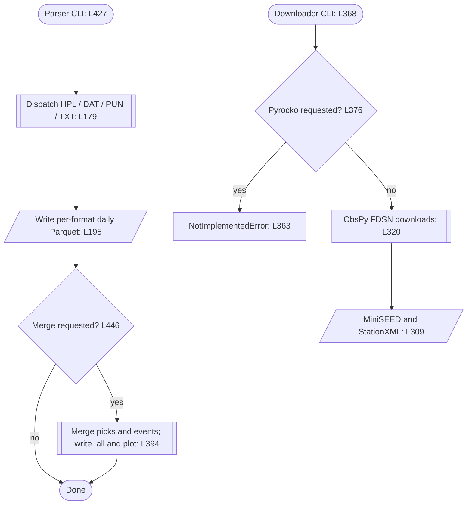
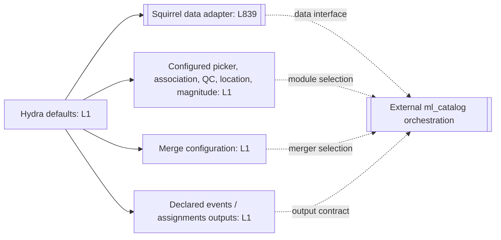
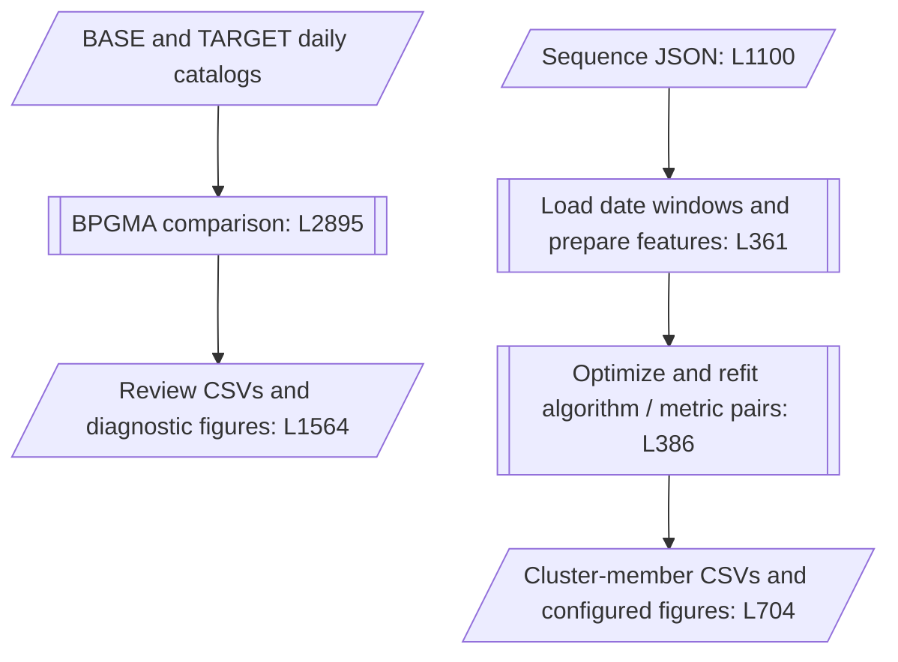

# OGS Seismic Toolkit (AI2Seism)

Research software for seismic catalog ingestion, waveform acquisition, ML-pipeline integration, catalog comparison, and event-sequence analysis, with applications in north-eastern Italy, and configurable research workflows for diverse seismic studies.

## Partners

<code><pre>
&nbsp;                          ###
&nbsp;                   #################
&nbsp;                ########################
&nbsp;             #############################
&nbsp;            ################################
&nbsp;          ###################################
&nbsp;  ........---------------------+++++##########
&nbsp; ........--------------------+++++++++#########
&nbsp;........--------------------+++++++++++#########
&nbsp;........---------                     ...........+++
&nbsp; ......--------                       ...........++++
&nbsp;  .....-------                      .............+++++
&nbsp;       ######....................................+++++
&nbsp;       #######...................................+++++
&nbsp;       #########-................................++++
&nbsp;        ################+           +###########
&nbsp;        ################.          .###########
&nbsp;         ##############+           -###########
&nbsp;          #############+           ##########
&nbsp;           ############.          -#########
&nbsp;             ##########           +#######
&nbsp;                ######.          .######
&nbsp;                   ###           -###
</pre></code>

<code><pre><pink>
&nbsp;                         ++++++++++++++++++++    +++++++++++
&nbsp;                     ++++++++++++++++++++++++   +++++++++++
&nbsp;                +++++++++++++++++++++++++++    +++++++++++
&nbsp;               +++++++++++
&nbsp;                 +++
&nbsp;                             +++++    +++++++++    ++++++++++++++
&nbsp;  ++++++++++++++       +++++++++        +++++     +++++++++++++++
&nbsp; ++++++++++++++++++      +++++     +++          +++++++++++++++++
&nbsp;+++++++++++++++++++++             +++++++         +++++++++++++++
&nbsp;+++++++++++++++++++++++      +++   +++++     +         ++++++++++
&nbsp;+++++++++++++++++++++++++     ++++         ++++++            ++++
&nbsp; ++++++++++++++++++++++++++     +++      ++++++++++++
&nbsp;  ++          +++++++++++++++              ++++++++++++++
&nbsp;                ++++++++++++++       +++      +++++++++++++++
&nbsp;                                      +++++     +++++++++++++
&nbsp;                                        +++++     +++++++++++
&nbsp;健                                        +++++      ++++++++
</pink></pre></code>

## Guide

- [Documentation](#documentation)
- [Repository and runtime layout](#repository-and-runtime-layout)
- [Environment setup](#environment-setup)
- [First checks](#first-checks)
- [Ingestion workflows](#ingestion-workflows)
- [ML processing on Leonardo](#ml-processing-on-leonardo)
- [Catalog comparison and sequence analysis](#catalog-comparison-and-sequence-analysis)
- [Validation](#validation)
- [Scientific and operational boundaries](#scientific-and-operational-boundaries)

## Documentation

| Start here | Contents |
|---|---|
| [OGS toolkit](OGS/README.md) | Runtime prerequisites, entrypoints, catalog storage, comparison, and clustering |
| [Source reference](OGS/src/README.md) | Module responsibilities and public Python API |
| [Configuration](OGS/conf/README.md) | Hydra defaults, stage composition, and overrides |
| [Tests](OGS/test/README.md) | Focused commands, fixtures, and integration boundaries |
| [Utilities](OGS/utils/README.md) | Leonardo SLURM workflows and local workstation utilities |
| [Local workstation guide](OGS/utils/.local/README.md) | Ubuntu/macOS boundaries and separately managed environments |
| [Research documentation](doc/README.md) | Thesis, publications, figures, and reports |
| [LLM workspace](LLM/README.md) | Context, prompts, experiments, evaluation, and human review |
| [Repository contract](AGENTS.md) | Approval, provenance, and operational boundaries |

## Repository and runtime layout

```text
OGS/       Python source, Hydra configuration, tests, utilities, reference data
doc/       research writing and publication sources
LLM/       controlled context, prompts, experiments, and review records
.agents/   skills and agent rules
.claude/   Claude agent profiles
.github/   Copilot profiles and repository automation
```

The source checkout and the runtime workspace are separate. Leonardo uses
`WORK_PATH` for deployed configuration, waveform archives, station metadata,
Squirrel databases, catalogs, and job artifacts. Paths and defaults are defined
by the [Leonardo Makefile](OGS/utils/Leonardo/Makefile#L65).

These are selectable workflows, not one automatically chained command:

| Workflow | Interface | Main output |
|---|---|---|
| Legacy catalog ingestion | `DataCatalog` / parser CLI | Daily Parquet event and pick tables |
| Waveform acquisition | `ObsPyDownloader` / downloader CLI | MiniSEED waveforms and StationXML metadata |
| ML integration | Hydra configuration and external `ml_catalog_run` | Configured pick, association, location, magnitude, and QC outputs |
| Catalog comparison | `OGSCatalog` Python API | Matching review tables and diagnostic figures |
| Sequence analysis | `OGSSequence` / sequence CLI | Cluster-member CSVs and configured figures |

## Environment setup

### Prerequisites

The checked-in [Leonardo environment definition](OGS/utils/Leonardo/LEONARDO.yml)
pins Python 3.12.13; the configured environment name is `SBC_3.12`.
It is a site-specific environment definition, not a guarantee of portability
or a tested Python-version support range.

Dependencies depend on the selected workflow:

- Catalog parsing/comparison: scientific Python packages, pandas, a Parquet
  engine, plotting libraries, and NetworkX.
- Waveform acquisition: ObsPy and access to an appropriate FDSN provider.
- ML processing: a compatible external `ml_catalog` installation, Hydra,
  SeisBench/PyTorch, waveform inputs, and the selected stage dependencies.
- NonLinLoc processing: native binaries and prepared velocity/travel-time resources.
- Sequence analysis: the selected clustering backends and existing event data.

For a new environment, review the environment definition and prepare approved
external dependencies first. The repository does not provide a reliable
one-command fresh-checkout bootstrap.

### Activate an existing Leonardo environment

From the repository root, replace the workspace placeholder with an existing,
approved runtime workspace. Mirror any `CONDA_ROOT` or `CONDA_ENV` overrides
used with the Makefile:

```bash
export WORK_PATH="<existing-runtime-workspace>"
CONDA_ROOT="${CONDA_ROOT:-$(cd "$WORK_PATH/.." && pwd)/.miniconda3}"
CONDA_ENV="${CONDA_ENV:-SBC_3.12}"
source "$CONDA_ROOT/etc/profile.d/conda.sh"
conda activate "$CONDA_ROOT/envs/$CONDA_ENV"
```

This activates an existing environment; it does not install software or
initialize the workspace. Leonardo batch jobs additionally load site modules
through [ACTIVATEME.sh](OGS/utils/Leonardo/ACTIVATEME.sh).

**Do not use `make init` as a harmless first check.**
The [initializer](OGS/utils/Leonardo/init.sh) can copy/link workspace files,
clone dependencies, install Conda, create an environment, build NonLinLoc,
and submit smoke-test jobs. Its dependency configuration includes a placeholder
`ml_catalog` Git URL and a dataset archive endpoint passed to `git clone`.
Review and approve setup separately.

Local workstations need a separately prepared compatible environment.
Do not run Leonardo module-loading or SLURM helpers locally; use the
[local workstation guide](OGS/utils/.local/README.md).

## First checks

From the repository root:

```bash
make -C OGS/utils/Leonardo help
make -C OGS/utils/Leonardo -n "PhaseNet[INSTANCE,0.1]" \
  START_DATE=20220101 END_DATE=20220102
```

The first command lists targets; the second prints a stage recipe without
running it. Quote bracketed targets to prevent shell glob expansion.

After environment activation, inspect supported CLI arguments:

```bash
python -m OGS.src.ogsparser --help
python -m OGS.src.ogsdownloader --help
python -m OGS.src.ogssequence --help
```

Use `python -m OGS.src.<module>` from the repository root, rather than running
files with relative sibling imports directly.

Root-level Python code uses `OGS` / `OGS.src.*`. Deployed Hydra configuration
uses `src.*` targets and expects the corresponding runtime import layout.
Do not mix these layouts in one application. The [public API](OGS/src/README.md#public-python-api)
loads exported classes lazily; accessing a class still requires its dependencies.

## Ingestion workflows

**Observed source behavior:** catalog parsing and waveform downloading are
independent entrypoints. Neither automatically invokes the other.



The examples below use illustrative relative paths. Replace them with approved
input/output locations; keep production or restricted data outside the checkout.
Use a fresh output directory when you need to preserve earlier results.

### Parse existing legacy catalogs

Requires existing input files. Dates use inclusive `YYYYMMDD` bounds.

```bash
python -m OGS.src.ogsparser \
  --file inputs/catalog/events.hpl inputs/catalog/picks.dat \
  --dates 20220101 20221231 \
  --output outputs/manual_catalog \
  --merge \
  --verbose
```

Supported suffixes are `.dat`, `.hpl`, `.pun`, and `.txt`. Alternatively, use
`--directory inputs/catalog --ext .hpl .dat` instead of `--file ...`;
file and directory selection are mutually exclusive.

Per-format outputs use extensionless Parquet filenames:

```text
outputs/manual_catalog/.hpl/events/YYYY-MM-DD
outputs/manual_catalog/.dat/assignments/YYYY-MM-DD
outputs/manual_catalog/.all/events/YYYY-MM-DD
outputs/manual_catalog/.all/assignments/YYYY-MM-DD
```

Available tables depend on the input format. `--merge` also invokes plotting.
Writes can replace existing partitions, and some write failures are logged
without being re-raised: check logs and output completeness.
See [catalog ingestion and storage](OGS/README.md#catalog-ingestion-and-storage).

### Download an approved waveform window

This example contacts external services and writes files. The waveform and
station directories must already exist. Provider/network/date availability
must be checked independently.

```bash
python -m OGS.src.ogsdownloader \
  --dates 20220101 20220101 \
  --client INGV \
  --network OX \
  --station '*' \
  --rectdomain 9.5 15.0 44.3 47.5 \
  --waveforms inputs/waveform \
  --stations inputs/station \
  --threads 4 \
  --timeout 60 \
  --verbose
```

The single date requests a full day ending at the next midnight. Waveforms
are stored under `inputs/waveform/YYYY/MM/DD/`; StationXML is stored under
`inputs/station`. Restricted data may require an approved token file through
`--key`; never commit credentials.

Use the ObsPy backend. The downloader's `--pyrocko` implementation raises
`NotImplementedError`; the separate Pyrocko/Squirrel ML data adapter is implemented.

## ML processing on Leonardo

The checked-in Hydra configuration supplies data access, processing modules,
merging, and output settings to external `ml_catalog` orchestration.
This is a **configuration/dependency map**, not a verified execution-order
diagram of the external runner.



The current Make registries contain PhaseNet/EQTransformer pickers,
PyOcto/GaMMA associators, and NLL1D/NLL3D locators.
REAL has configuration but is not registered as a generated Make target.
Configuration defaults include site-specific paths and dates; inspect
[configuration](OGS/conf/README.md) before deployment.

Preview selected stages from the repository root:

```bash
make -C OGS/utils/Leonardo -n "PhaseNet[INSTANCE,0.1]" \
  START_DATE=20220101 END_DATE=20220102

make -C OGS/utils/Leonardo -n "PyOcto[PhaseNet,INSTANCE,0.1]" \
  START_DATE=20220101 END_DATE=20220102

make -C OGS/utils/Leonardo -n "NLL1D[PyOcto,PhaseNet,INSTANCE,0.1]" \
  START_DATE=20220101 END_DATE=20220102
```

These are previews, not production submissions. Actual runs use the prepared
`WORK_PATH` deployment, its launch files, reviewed Hydra configuration, and
approved cluster allocations. They are not run by this README update.

**Downstream targets do not submit upstream stages as prerequisites or attach
scheduler dependencies.** Confirm upstream job completion and output contents
before submitting association or location. The `all` target selects a locator
recipe, not a complete download-to-location workflow. See the
[utilities guide](OGS/utils/README.md#hpc-execution-workflow).

## Catalog comparison and sequence analysis

**Observed source behavior:** comparison and clustering are independent.
The diagram summarizes their selected paths; unavailable comparison passes,
empty event windows, and invalid clustering results can be skipped.



### Compare existing catalogs

Use the Python API rather than the workstation-specific executable example
inside the catalog module. This example requires two existing catalog roots
and StationXML metadata for pick comparison:

```python
from datetime import datetime
from pathlib import Path

from OGS import OGSCatalog

options = {
    "start": datetime(2022, 1, 1),
    "end": datetime(2022, 12, 31),
    "polygon": None,
    "output": Path("outputs/comparison"),
    "verbose": True,
}

base = OGSCatalog(
    input=Path("outputs/manual_catalog/.all"),
    name="Reference",
    **options,
)
target = OGSCatalog(
    input=Path("inputs/target_catalog"),
    name="Target",
    **options,
)

base.bpgma(target, stations=Path("inputs/station"))
```

Provide dated files under `events/` and `assignments/` or `picks/`.
Use explicit date bounds: the catalog constructor's default inverted window
selects no days. Construction creates output/image directories despite lazy
table loading.

For event-only comparison without station metadata, use
`base.BPGMAEvents(target)` instead of `base.bpgma(...)`.
Comparison uses daily maximum-weight one-to-one bipartite matching, not greedy
nearest neighbours or cross-day matching. It writes review tables and figures;
review the [matching rules and rates](OGS/README.md#catalog-comparison) before
interpreting them. Logged read failures can yield empty frames.

### Analyze an existing event sequence

Prepare a reviewed JSON configuration, then run:

```bash
python -m OGS.src.ogssequence \
  --input inputs/sequence.json \
  --verbose
```

The JSON needs an existing catalog `directory`, date `ranges`, and selected
`eval_metrics`. Set `algorithms` explicitly: omitting it or supplying an empty
selection enables all registered algorithms. Review
[input.json](OGS/src/input.json) as a structural example, not a portable ready-to-run
configuration; it contains workstation-specific values.

The implementation builds and standardizes spatial/depth and inter-event-time
features per window, then searches and refits algorithm/metric pairs.
Cluster-member CSVs are written beneath `Clusters/`; configured `angles_deg`
also enables figures. Working-directory-relative window/image directories
are created. Run from a suitable analysis working directory with a valid
package import path if these outputs should be outside the checkout.
See [sequence clustering](OGS/README.md#sequence-clustering).

## Validation

Documentation-only checks from the repository root:

```bash
bash LLM/scripts/handler.sh validate --file README.md
bash LLM/scripts/handler.sh validate --root "$PWD"
git diff --check -- README.md
```

These check documentation/scaffold structure, local paths, and managed scripts.
They do not validate Python dependencies, scientific accuracy, or Mermaid rendering.

For software changes, activate the configured environment and select the
smallest relevant test slice:

```bash
python -m pytest -q OGS/test/testogsdatafile.py OGS/test/testogsparser.py
```

Broader focused groups are available through `make -C OGS/test parser-tests`
and `make -C OGS/test catalog-support-tests`. Consult the
[tests guide](OGS/test/README.md) before running integration tests that require
external binaries or datasets.

## Scientific and operational boundaries

- Waveforms and inventories are observations; reference picks and catalogs
  contain analyst labels. ML picks, associations, locations, magnitudes,
  and cluster assignments are derived outputs, not independent ground truth.
- Record input provenance, configuration/model versions, date windows, output
  completeness, and human review before reporting scientific results.
- Passing software or documentation checks does not establish scientific
  accuracy or successful production processing.
- Downloads, inference, environment installation, workspace initialization,
  destructive cleanup, and SLURM submission require separate approval.
- Keep credentials and restricted/raw production inputs out of the repository.
  Follow the [repository contract](AGENTS.md) and the
  [LLM workspace evidence boundary](LLM/README.md#evidence-boundary).
